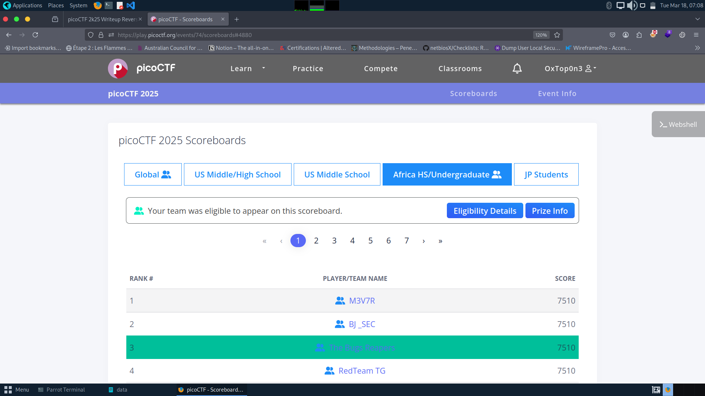

Pico CTF 2025 Write up . By Bug Reapers Team

Pico CTF is an annual Cyber security competition for undergrade/grate Studen.
Our Team **Bug Reapers**  took part of 2025 one Where we finish Top 3 of AFrica score board
The competiotn take 10 days. From 07 Mars to 17 Mars

Here is the write up of all Challenges that we solve durant the competition

[Reverse Engineering](pico-CTF-Writeup-RE)

[Binary Exploitation](binary_exploitation.md)

[Web Hacking](web.md)

[Forensic](forensic)

[Crypo](Crypto)

